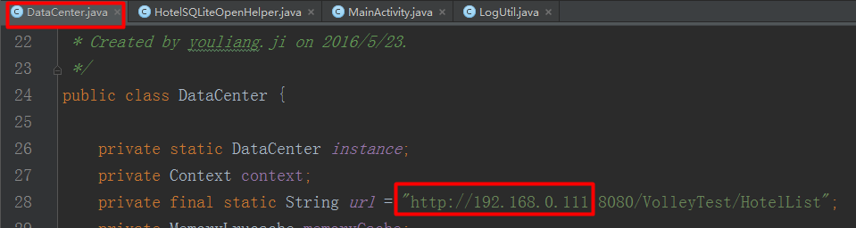

## 三级存储：如何将网络json存储到内存，缓存到数据库（文件也是一样的道理）

### 1.JSON三级存储

你听过图片三级存储，但肯定没听过如何处理json三级存储

### 2.截图

### 3.使用技术

* 1.Lrucache处理内存存储
* 2.UniversalImageLoader加载图片
* 3.Sqllite存储缓存处理

### 4.Usage

结合服务器使用

* 1.服务器：[https://github.com/jiyouliang/VolleyTest](https://github.com/jiyouliang/VolleyTest "VolleyTest")部署到MyEclipse
* 2.客户端：DataStorage
	* DataCenter类中改成你的ip，如下图

